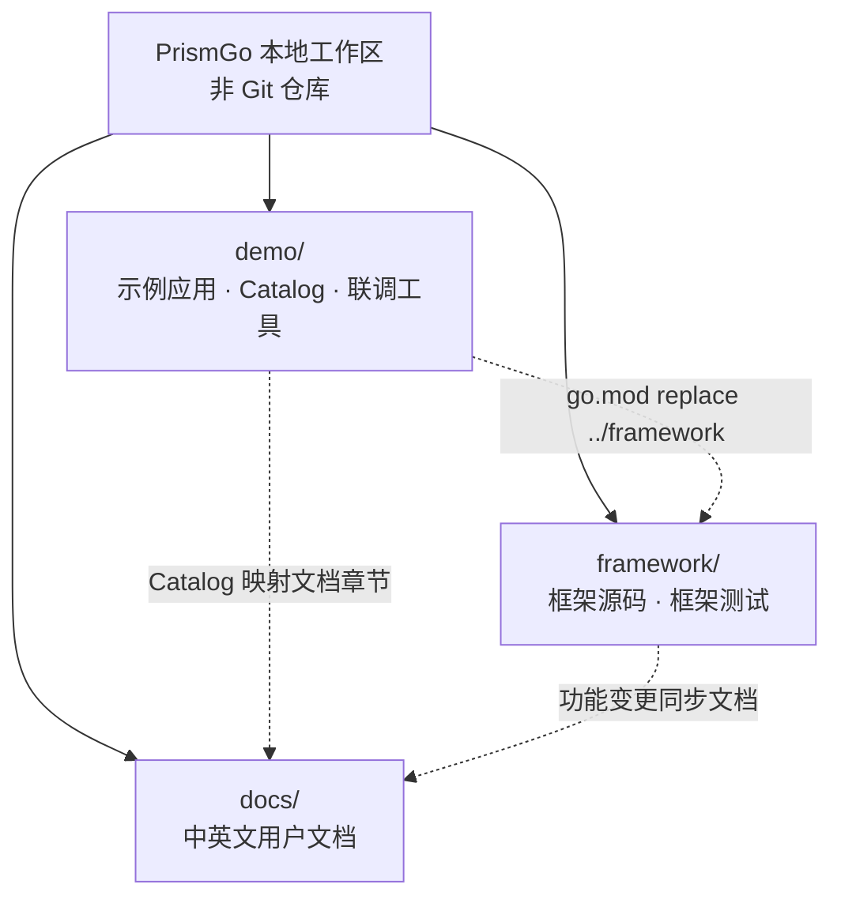

<p align="center">
  
</p>

<div align="center">

**PrismGo —— 像写 Laravel 一样写 Go**

[](https://go.dev/)
[](https://github.com/prismgo/framework)
[](https://codecov.io/gh/prismgo/framework)
[](https://pkg.go.dev/github.com/prismgo/framework?tab=versions)
[](./LICENSE)

简体中文 | [English](README_en.md)

</div>

---

## 简介

PrismGo Demo 是框架的**可运行示例与本地联调项目**，通过 `go.mod` 的本地 `replace` 直接使用同级 `framework/` 源码。

Demo 项目主要承担四件事：

- **展示用法**：以路由、命令、模型、仓储、事务、队列任务和定时任务等真实应用代码展示框架组合方式。
- **维护覆盖目录**：Catalog 将“Framework 版本 → 功能模块 → 文档章节 → 示例 → 测试”串成可查询的进度地图。
- **隔离验证**：默认测试 Application 使用 SQLite、内存/文件驱动和临时目录，不依赖开发环境的 `.env`。
- **本地联调**：`./dev` 统一初始化工作区，并按需管理 MySQL、PostgreSQL、SQL Server、Redis 和 RabbitMQ。

| 路径 | 作用 |
|---|---|
| `app/demo/catalog/` | Catalog 数据、模块进度和文档映射 |
| `app/demo/` | 可执行的功能示例与场景测试 |
| `app/models/`、`app/repositories/`、`app/services/` | 订单领域的模型、仓储和业务服务示例 |
| `app/demo/testing/` | 与本地开发环境隔离的测试 Application |
| `database/migrations/` | Demo 数据表迁移 |
| `.dev/`、`dev` | 工作区初始化、本地依赖和联调工具 |

## Catalog 进度地图

Catalog 当前覆盖 **29 个模块、87 个条目**：已实现 28 个、计划中 56 个、手工验证 3 个。以下是 README 更新时的快照；`app/demo/catalog/` 是唯一数据源，实时进度以 `demo:list` 输出为准。

| 模块 | 覆盖范围 | 进度 | 剩余 | 状态 |
|---|---|---:|---:|---|
| `cache` | 缓存存储、标签与锁 | 0/1 | 1 | 计划中 |
| `commands` | Console 命令发现 | 1/1 | 0 | 已实现 |
| `config` | 环境与应用配置 | 0/1 | 1 | 计划中 |
| `console` | Artisan 风格命令与终端 IO | 0/1 | 1 | 计划中 |
| `container` | 依赖绑定与解析 | 0/1 | 1 | 计划中 |
| `cookie` | Cookie 值与排队写入 | 0/1 | 1 | 计划中 |
| `database` | 数据库连接与连接池 | 0/1 | 1 | 计划中 |
| `encryption` | 应用数据加密 | 0/1 | 1 | 计划中 |
| `event` | 同步、异步与队列事件 | 0/1 | 1 | 计划中 |
| `exception` | 异常报告与渲染 | 0/1 | 1 | 计划中 |
| `facade` | 框架 Facade 访问 | 0/1 | 1 | 计划中 |
| `filesystem` | 本地、公共与云文件系统 | 0/1 | 1 | 计划中 |
| `horizon` | 队列监控与 Worker 管理 | 0/1 | 1 | 计划中 |
| `http-server` | HTTP 服务启动与生命周期 | 0/1 | 1 | 计划中 |
| `installation` | 应用安装流程 | 0/1 | — | 手工验证 |
| `lens` | Lens 开发流程 | 0/1 | — | 手工验证 |
| `lifecycle` | 应用启动与关闭 | 0/1 | 1 | 计划中 |
| `logger` | 多通道应用日志 | 0/1 | 1 | 计划中 |
| `queue` | 队列、任务与 Worker | 27/59 | 32 | 进行中 |
| `ratelimit` | 请求与操作限流 | 0/1 | 1 | 计划中 |
| `redis` | Redis 连接与操作 | 0/1 | 1 | 计划中 |
| `route` | HTTP 路由注册 | 0/1 | 1 | 计划中 |
| `schema` | 数据库 Schema 与迁移构建器 | 0/1 | 1 | 计划中 |
| `service-provider` | Service Provider 注册与生命周期 | 0/1 | 1 | 计划中 |
| `session` | 服务端 Session 存储 | 0/1 | 1 | 计划中 |
| `starter` | 生成应用的起始模板 | 0/1 | — | 手工验证 |
| `support` | 通用框架辅助函数 | 0/1 | 1 | 计划中 |
| `timer` | 定时任务定义 | 0/1 | 1 | 计划中 |
| `translation` | 应用翻译与复数处理 | 0/1 | 1 | 计划中 |

在工作区根目录查看实时地图与条目明细：

```bash
go run ./demo demo:list
go run ./demo demo:show queue
go run ./demo demo:show queue --status=planned
go run ./demo demo:show queue --level=integration
go run ./demo demo:list --json
```

状态含义：`已实现` 表示模块全部条目已落地；`进行中` 表示部分条目已落地；`计划中` 表示尚无已实现条目；`手工验证` 表示由安装器、Lens 等外部流程验证，因此不计入“剩余”数量。

## 本地开发工作区与 `dev` 脚本

PrismGo 本地开发采用三仓并列结构。工作区根目录只负责组织仓库和共享配置，本身不是 Git 仓库；`demo/`、`framework/`、`docs/` 各自拥有独立的 Git 历史。



| 仓库 | 修改内容 | 不应放入 |
|---|---|---|
| `demo/` | Demo、Catalog、场景测试、本地依赖与开发工具 | 框架公开 API 的真实实现 |
| `framework/` | 框架实现、公开 API、组件与框架测试 | Demo 专属业务示例 |
| `docs/` | 面向使用者的中英文指南与 API 说明 | 框架或 Demo 实现代码 |

所有 `dev` 命令都建议从工作区根目录运行。首次准备工作区：

```bash
./demo/dev init
./demo/dev doctor
```

`init` 会创建工作区 Agent 指令与 skill 链接、克隆缺失的 `framework/` 和 `docs/` 仓库、在缺失时创建 `demo/.env`、维护包含 `demo/` 与 `framework/` 的 `go.work`，并下载框架依赖。它不会覆盖已有仓库或已有的 `demo/.env`。`doctor` 用于检查 Docker、Compose 等前置条件并验证 Compose 配置。

### 常用 `dev` 命令

| 命令 | 用法 |
|---|---|
| `./demo/dev help` | 查看命令列表和可用服务名 |
| `./demo/dev up [service...]` | 启动全部或指定依赖，并等待健康检查 |
| `./demo/dev status` | 查看服务健康状态、本地端口和连接信息 |
| `./demo/dev logs [service]` | 持续查看全部或指定服务的日志 |
| `./demo/dev env` | 重新生成并输出 `demo/.dev/runtime/test.env` |
| `./demo/dev test [go-test-args]` | 启动依赖，并在 `framework/` 中运行指定集成测试 |
| `./demo/dev down` | 停止服务但保留本地数据 |
| `./demo/dev reset [--yes]` | 删除全部本地测试数据并重建环境；请谨慎使用 |

可选服务名为 `mysql`、`postgres`、`sqlserver`、`redis`、`rabbitmq` 和 `sqlite`。通常只启动当前任务需要的依赖：

```bash
./demo/dev up mysql redis
./demo/dev status
./demo/dev logs redis
```

加载脚本生成的测试连接变量，或直接通过统一入口运行框架集成测试：

```bash
./demo/dev env
source demo/.dev/runtime/test.env

./demo/dev test ./queue/... ./horizon/...
./demo/dev down
```

Demo 自身的默认测试使用隔离驱动，不需要启动 Docker：

```bash
cd demo
GOWORK=off go test . ./app/... ./bootstrap/... ./config/... ./database/... ./routes/...
```

完整的服务地址、环境变量、安全提示和排障方法见[本地测试环境说明](.dev/docs/local-test-environment.md)。
