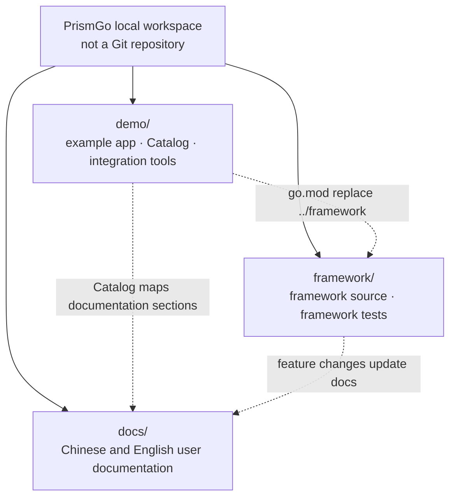

<p align="center">
  
</p>


<div align="center">

**PrismGo - Write Go Like Laravel**

[](https://go.dev/)
[](https://github.com/prismgo/framework)
[](https://codecov.io/gh/prismgo/framework)
[](https://pkg.go.dev/github.com/prismgo/framework?tab=versions)
[](./LICENSE)

[简体中文](README.md) | English

</div>

---

## Introduction

PrismGo Demo is the framework's **runnable example and local integration project**. A local `replace` in `go.mod` points directly to the sibling `framework/` source.

The Demo project has four main responsibilities:

- **Demonstrate usage** through real application code for routes, commands, models, repositories, transactions, queued jobs, scheduled tasks, and more.
- **Maintain the coverage catalog**, mapping Framework version → feature → documentation section → example → test as a queryable progress map.
- **Provide isolated verification** with a test Application that defaults to SQLite, memory/file drivers, and temporary directories without reading the development `.env`.
- **Support local integration** through `./dev`, which initializes the workspace and manages MySQL, PostgreSQL, SQL Server, Redis, and RabbitMQ as needed.

| Path | Purpose |
|---|---|
| `app/demo/catalog/` | Catalog data, feature progress, and documentation mappings |
| `app/demo/` | Runnable feature examples and scenario tests |
| `app/models/`, `app/repositories/`, `app/services/` | Model, repository, and business-service examples for the order domain |
| `app/demo/testing/` | Test Application isolated from the local development environment |
| `database/migrations/` | Demo database migrations |
| `.dev/`, `dev` | Workspace initialization, local dependencies, and integration tools |

## Catalog Progress Map

The catalog currently covers **29 modules and 87 entries**: 28 implemented, 56 planned, and 3 manually verified. The table below is a snapshot taken when this README was updated. `app/demo/catalog/` is the single source of truth; use `demo:list` for live progress.

| Module | Coverage | Progress | Remaining | Status |
|---|---|---:|---:|---|
| `cache` | Cache stores, tags, and locks | 0/1 | 1 | Planned |
| `commands` | Console command discovery | 1/1 | 0 | Implemented |
| `config` | Environment and application configuration | 0/1 | 1 | Planned |
| `console` | Artisan-style commands and terminal IO | 0/1 | 1 | Planned |
| `container` | Dependency binding and resolution | 0/1 | 1 | Planned |
| `cookie` | Cookie values and queued writes | 0/1 | 1 | Planned |
| `database` | Database connections and pools | 0/1 | 1 | Planned |
| `encryption` | Application data encryption | 0/1 | 1 | Planned |
| `event` | Synchronous, asynchronous, and queued events | 0/1 | 1 | Planned |
| `exception` | Exception reporting and rendering | 0/1 | 1 | Planned |
| `facade` | Framework facade access | 0/1 | 1 | Planned |
| `filesystem` | Local, public, and cloud filesystems | 0/1 | 1 | Planned |
| `horizon` | Queue monitoring and worker management | 0/1 | 1 | Planned |
| `http-server` | HTTP server startup and lifecycle | 0/1 | 1 | Planned |
| `installation` | Application installation workflow | 0/1 | — | Manual |
| `lens` | Lens development workflow | 0/1 | — | Manual |
| `lifecycle` | Application bootstrap and shutdown | 0/1 | 1 | Planned |
| `logger` | Multi-channel application logging | 0/1 | 1 | Planned |
| `queue` | Queues, jobs, and workers | 27/59 | 32 | In progress |
| `ratelimit` | Request and action rate limiting | 0/1 | 1 | Planned |
| `redis` | Redis connections and operations | 0/1 | 1 | Planned |
| `route` | HTTP route registration | 0/1 | 1 | Planned |
| `schema` | Database schema and migration builder | 0/1 | 1 | Planned |
| `service-provider` | Service provider registration and lifecycle | 0/1 | 1 | Planned |
| `session` | Server-side session storage | 0/1 | 1 | Planned |
| `starter` | Generated application starter | 0/1 | — | Manual |
| `support` | General framework helpers | 0/1 | 1 | Planned |
| `timer` | Scheduled task definitions | 0/1 | 1 | Planned |
| `translation` | Application translation and pluralization | 0/1 | 1 | Planned |

From the workspace root, inspect the live map and entry details with:

```bash
go run ./demo demo:list
go run ./demo demo:show queue
go run ./demo demo:show queue --status=planned
go run ./demo demo:show queue --level=integration
go run ./demo demo:list --json
```

Status meanings: `Implemented` means every entry in the module is complete; `In progress` means some entries are complete; `Planned` means no entries are implemented yet; `Manual` means an external workflow such as the installer or Lens performs verification, so it is not counted as remaining work.

## Local Development Workspace and the `dev` Script

PrismGo local development uses three sibling repositories. The workspace root only organizes repositories and shared configuration; it is not itself a Git repository. `demo/`, `framework/`, and `docs/` each have independent Git history.



| Repository | What belongs here | What does not belong here |
|---|---|---|
| `demo/` | Demos, the Catalog, scenario tests, local dependencies, and development tools | Real implementations of framework public APIs |
| `framework/` | Framework implementations, public APIs, components, and framework tests | Demo-specific business examples |
| `docs/` | Chinese and English user guides and API documentation | Framework or Demo implementation code |

Run all `dev` commands from the workspace root. Prepare a workspace for the first time with:

```bash
./demo/dev init
./demo/dev doctor
```

`init` creates workspace Agent-instruction and skill links, clones missing `framework/` and `docs/` repositories, creates `demo/.env` when absent, maintains a `go.work` containing `demo/` and `framework/`, and downloads framework dependencies. It does not overwrite existing repositories or an existing `demo/.env`. `doctor` checks prerequisites such as Docker and Compose and validates the Compose configuration.

### Common `dev` Commands

| Command | Usage |
|---|---|
| `./demo/dev help` | Show commands and available service names |
| `./demo/dev up [service...]` | Start all or selected dependencies and wait for health checks |
| `./demo/dev status` | Show service health, local ports, and connection details |
| `./demo/dev logs [service]` | Follow logs for all services or one service |
| `./demo/dev env` | Regenerate and print `demo/.dev/runtime/test.env` |
| `./demo/dev test [go-test-args]` | Start dependencies and run selected integration tests in `framework/` |
| `./demo/dev down` | Stop services while retaining local data |
| `./demo/dev reset [--yes]` | Delete all local test data and rebuild the environment; use with care |

Available service names are `mysql`, `postgres`, `sqlserver`, `redis`, `rabbitmq`, and `sqlite`. Usually, start only the dependencies needed by the current task:

```bash
./demo/dev up mysql redis
./demo/dev status
./demo/dev logs redis
```

Load the generated test connection variables, or run framework integration tests through the unified entry point:

```bash
./demo/dev env
source demo/.dev/runtime/test.env

./demo/dev test ./queue/... ./horizon/...
./demo/dev down
```

The Demo's default tests use isolated drivers and do not require Docker:

```bash
cd demo
GOWORK=off go test . ./app/... ./bootstrap/... ./config/... ./database/... ./routes/...
```

See the [local test environment guide](.dev/docs/local-test-environment.md) for service addresses, environment variables, security notes, and troubleshooting.
